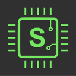

<!-- ABOUT THE PROJECT -->

## About The Framework

Sotom is a framework for developing embeded system firmware. It's a python based framework.



#### Built With

- [Python (Backend)](https://www.python.org/)
    - [D-Jango](https://www.djangoproject.com/)
- [React (Frontend)](https://reactjs.org/)

#### Currently Supported Chips

- [stm32f446re]()

<!-- GETTING STARTED -->

## Getting Started

To get a local copy up and running follow these simple steps.

### Prerequisites

This is an example of how to list things you need to use the software and how to install them.

- [python3](https://www.python.org/downloads/)
- [pip or pip3]()
- [arm-none-eabi-gcc](https://developer.arm.com/downloads/-/gnu-rm)
- [make](http://gnuwin32.sourceforge.net/packages/make.htm)


##### You also need to add all of this prerequisites to your environment variable.


### Sotom Installation

1.  Download the git repo

2.  Navigate to your sotom download folder. There you will see `sotom.py`

3.  Open the terminal here. And run command
    ```sh
    pip install -r requirements.txt
    ```
3.  Find your device pack from pyocd. Example: if the chip is stm32f446
    ```sh
    pyocd pack find stm32f446
    pyocd pack install stm32f446retx
    ```
    ##### This command will take 5-7 min to complete.
4.  Add `Sotom` folder to environment variable.

6.  Now sotom is ready to run. Just go to a directory where you want to  create a project. Write command:
    ```sh
    #create new project named LED_BLINK
    sotom create --name "LED_BLINK" --chip "stm32f446re"
    #move current directory to project folder
    cd "LED_BLINK"
    #if you want to open with vs code write
    code .
    #build project with:
    sotom build
    #open gui:
    sotom run
    ```
    ##### change the project name and chip name if you want. (NB: The chip must be supported by sotom)
<!-- USAGE EXAMPLES -->

## Usage & command line interface

To create a new project
```sh
sotom create --name project_name --chip chip_name
```
To add new device, libs, protocols:
```sh
# add device
# --device can be input,output,io. device_name should be uppercase
sotom add --device input device_name
sotom add --device output device_name
# add lib. library_name should be uppercase
sotom add --lib library_name
# add protocol. protocol_name should be uppercase
sotom add --protocol protocol_name
# add interrupt. interrupt_name should be uppercase
sotom add --interrupt interrupt_name
```
To add or remove package from project configuration:
```sh
#add libs
sotom config --add-lib library_name
#remove libs
sotom config --add-lib library_name
#add protocol
sotom config --add-protocol protocol_name
#remove protocol
sotom config --add-protocol protocol_name
#add device. device_type can be input, output, io
sotom config --add-device device_type device_name
#remove device
sotom config --remove-device device_type device_name
```
To install a prebuild package from sotom:
```sh
#prebuild devices: 
sotom install --device device_type device_name
#Example: Here device name is LCD162A
sotom install --device output LCD162A
#prebuild libs: 
sotom install --lib lib_name
#Example: Here lib name is GPIO
sotom install --lib GPIO
#prebuild protocol: 
sotom install --protocol protocol_name
#Example: Here protocol name is USART
sotom install --protocol USART
```
To build project and create makefile:
```sh
#auto generate makefile and build project 
sotom build
```
To flash command to device:
```sh
sotom flash
```
To run the IDE and Debugger.
```sh
#this will provide user a link
sotom run
```
<!-- ROADMAP -->

## Roadmap

See the [open issues](https://github.com/sislamrafi/sotom/issues) for a list of proposed features (and known issues).

<!-- CONTRIBUTING -->

## Contributing

Contributions are what make the open source community such an amazing place to be learn, inspire, and create. Any contributions you make are **greatly appreciated**.

1. Fork the Project
2. Create your Feature Branch (`git checkout -b feature/AmazingFeature`)
3. Commit your Changes (`git commit -m 'Add some AmazingFeature'`)
4. Push to the Branch (`git push origin feature/AmazingFeature`)
5. Open a Pull Request

<!-- LICENSE -->

## License

Distributed under the MIT License. See `LICENSE` for more information.

<!-- CONTACT -->

<!-- ## Contact

S Islam Rafi - [sislamrafi333@gmail.com](https://www.facebook.com/sislam.rafi/) - email

Project Link: [https://github.com/sislamrafi/webartisan](https://github.com/sislamrafi/webartisan) -->

<!-- ACKNOWLEDGEMENTS -->
